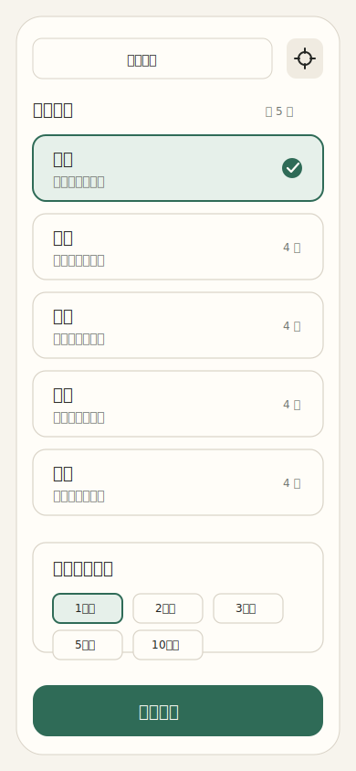
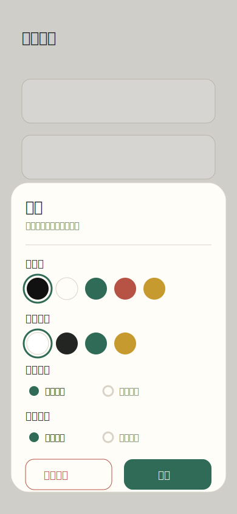
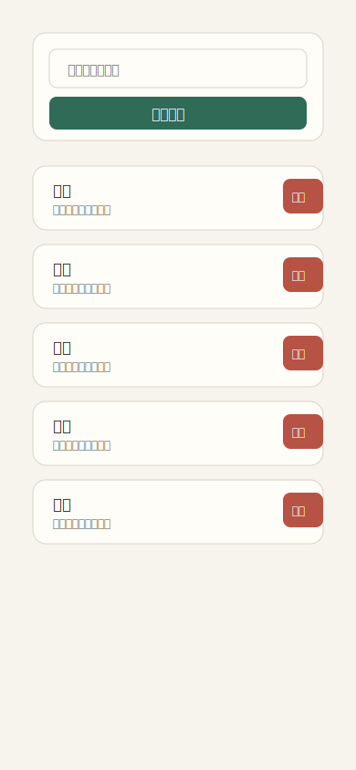
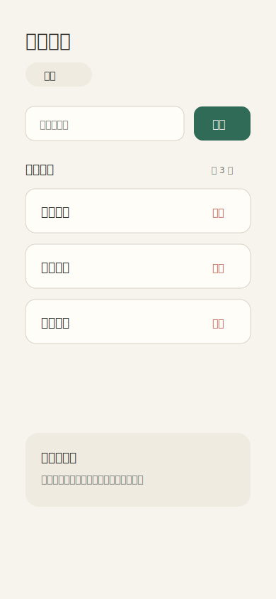
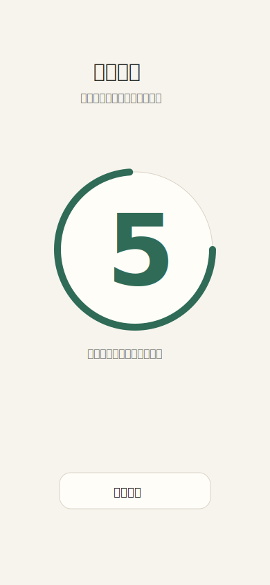

# 你比我猜 Android 应用 PRD

## 1. 文档信息

| 项目 | 内容 |
| --- | --- |
| 产品名称 | 你比我猜 |
| 文档类型 | 产品需求文档 PRD |
| 端类型 | Android 手机端应用 |
| 目标版本 | V1.0 |
| 技术实现 | uni-app 开发，打包为 APK |
| 需求来源 | `docs/req.txt`、`docs/development-requirements.md`、`docs/technical-development-document.md` |
| 编写日期 | 2026-07-10 |

## 2. 产品背景

聚会、团建、家庭娱乐等场景中，猜词类游戏上手门槛低、互动性强，但常见玩法依赖纸质卡片或临时查找词语，准备成本高，词库不易维护。  

“你比我猜”希望提供一个轻量、离线可用的 Android 应用，让用户可以快速选择词语分组并进入游戏，也可以自行维护分类和词语，适配不同聚会主题。

## 3. 产品目标

1. 用户打开应用后，可以在 3 次点击内开始一局猜词游戏。
2. 用户可以按分类维护词库，包括新增、删除分类和词语。
3. 游戏过程适合多人观看，猜词页采用横屏、大字号、跑马灯展示。
4. 用户可以调整猜词模式背景色、词条颜色、出词方式和词条滚动开关，并在下次打开应用时保留设置。
5. 首版不依赖网络、不需要账号、不申请敏感权限。

## 4. 用户与场景

### 4.1 目标用户

| 用户 | 说明 | 核心诉求 |
| --- | --- | --- |
| 聚会组织者 | 负责发起游戏、准备词库。 | 快速开始游戏，能维护适合当次活动的词语。 |
| 普通玩家 | 参与猜词游戏。 | 词条清晰可见，切换流畅，操作简单。 |
| 词库维护者 | 维护分类和词语的人，首版通常也是聚会组织者。 | 能方便新增、删除分类和词语。 |

### 4.2 典型场景

| 场景 | 描述 |
| --- | --- |
| 聚会破冰 | 用户选择“成语”“动物”等分类，快速开始游戏。 |
| 主题活动 | 用户提前新增一个主题分类，并添加自定义词语。 |
| 临场补词 | 游戏前发现词语不够，用户进入词语管理页追加词语。 |
| 远距离展示 | 游戏时手机横屏放置，词条需要醒目、可读。 |

## 5. 版本范围

### 5.1 V1.0 包含

| 优先级 | 功能 | 说明 |
| --- | --- | --- |
| P0 | 首页分组列表 | 展示所有词语分组和词语数量。 |
| P0 | 开始游戏 | 选择分组后进入 5 秒倒计时，再进入猜词模式。 |
| P0 | 猜词模式 | 横屏展示当前词条，支持跑马灯展示。 |
| P0 | 手动切词 | 用户滑动后进入下一个词语，末尾循环到第一个。 |
| P0 | 游戏时长 | 开始游戏前必须单选 1、2、3、5、10 分钟之一。 |
| P0 | 倒计时与音效 | 准备倒计时、游戏开始、最后 10 秒和游戏结束提供语音提示音。 |
| P0 | 本地存储 | 分类、词语、用户设置均保存在本地。 |
| P1 | 分类管理 | 支持新增、删除分类。 |
| P1 | 词语管理 | 支持在分类下新增、删除词语。 |
| P1 | 设置面板 | 支持设置猜词模式背景色、词条颜色、出词方式和词条滚动开关。 |
| P1 | 设置持久化 | 设置保存后下次打开仍然生效。 |
| P1 | 退出猜词模式 | 用户可从猜词模式返回首页。 |

### 5.2 V1.0 不包含

1. 用户账号、登录、注册。
2. 云端词库同步。
3. 在线词库下载。
4. 排行榜、得分、答对、跳过、计时统计。
5. 语音识别或自动判断答案。
6. 分类和词语编辑名称。
7. 批量导入、导出词库。
8. iOS、小程序、Web 发布。

## 6. 核心流程

### 6.1 开始游戏流程

1. 用户打开 App，进入首页。
2. 首页展示词语分组列表。
3. 用户选择一个词语分组。
4. 用户单选猜词时间：1 分钟、2 分钟、3 分钟、5 分钟或 10 分钟。
5. 用户点击“开始游戏”。
6. 系统校验该分组下是否有词语，并校验是否已选择猜词时间。
7. 校验通过后进入倒计时页，Android 真机环境下倒计时页立即切换为横屏。
8. 倒计时页先完整播放“游戏在5秒后开始，请将手机屏幕对着你的队友，加油哦”，播放完成后再开始 5 秒数字读秒。
9. 倒计时结束后进入横屏猜词模式。
10. 系统展示该分组下第一个词语，并在顶部居中展示本局剩余时间。
11. 用户滑动切换下一个词语。
12. 游戏剩余 10 秒开始每秒播放数字倒计时提示音，时间到播放“本局游戏结束，再接再厉哦”。
13. 用户通过右上角退出入口或游戏结束弹窗返回首页。

### 6.2 维护词库流程

1. 用户从首页进入分类管理。
2. 用户新增或删除分类。
3. 用户点击某个分类，进入词语管理。
4. 用户新增或删除该分类下词语。
5. 系统保存变更到本地。
6. 用户返回首页后，分组列表和词语数量更新。

### 6.3 修改设置流程

1. 用户点击首页内容区首行右侧设置入口。
2. 系统打开设置面板。
3. 用户选择背景色、词条颜色、出词方式或词条滚动开关。
4. 用户保存设置。
5. 后续进入猜词模式时应用最新设置。
6. 用户下次打开应用时继续使用已保存设置。

## 7. 页面需求

### 7.0 页面原型交付要求

1. PRD 配套页面原型需使用 SVG 格式生成和交付。
2. 每个核心页面至少提供一份 SVG 页面稿，包括首页、设置面板、分类管理页、词语管理页、倒计时页、猜词模式页。
3. SVG 页面稿需体现页面结构、主要按钮、关键状态和核心文案。
4. SVG 页面稿仅作为产品和视觉沟通稿，不要求直接作为最终前端代码使用。

### 7.0.1 SVG 页面原型预览

| 页面 | SVG 页面稿 |
| --- | --- |
| 首页 |  |
| 设置面板 |  |
| 分类管理页 |  |
| 词语管理页 |  |
| 倒计时页 |  |
| 猜词模式页 |  |

### 7.1 首页

#### 页面目标

帮助用户快速选择词语分组并开始游戏。

#### 页面元素

| 元素 | 说明 |
| --- | --- |
| 原生导航栏标题 | 显示“你比我猜”，内容区不再重复展示同名标题。 |
| 设置入口 | 位于内容区首行右侧，打开设置面板。 |
| 分类管理入口 | 进入分类管理页。 |
| 词语分组列表 | 展示全部分类。 |
| 分组项 | 显示分类名称和词语数量。 |
| 猜词时间 | 单选项，包含 1 分钟、2 分钟、3 分钟、5 分钟、10 分钟。 |
| 开始游戏按钮 | 选中分组后可开始游戏。 |

#### 交互规则

1. 首次进入首页时，如果本地没有数据，系统初始化默认分类和默认词语。
2. 用户点击分组后，该分组进入选中状态。
3. 未选择分组时，开始游戏按钮置灰或点击后提示“请选择词语分组”。
4. 已选择分组但分组无词语时，点击开始游戏提示“该分组暂无词语”。
5. 开始游戏前必须单选猜词时间，未选择时提示“请选择猜词时间”。
6. 点击可用的开始游戏按钮后，跳转倒计时页。
7. 首版首页不应用用户设置中的背景色和词条颜色。
8. 首页内容区不重复展示与原生导航栏相同的页面标题。

### 7.2 设置面板

#### 页面目标

配置猜词模式展示样式。

#### 设置项

| 设置项 | 说明 | 默认值 |
| --- | --- | --- |
| 背景色 | 仅作用于猜词模式背景。 | `#111111` |
| 词条颜色 | 仅作用于猜词模式词条文字。 | `#FFFFFF` |
| 出词方式 | 控制猜词模式按顺序或随机展示词条。 | 顺序出词 |
| 词条滚动 | 控制猜词模式词条是否以横向跑马灯滚动。 | 开启滚动 |

#### 交互规则

1. 用户可从首页打开设置面板。
2. 用户保存后，设置写入本地存储。
3. 若用户在首页修改设置，保存后不改变首页样式。
4. 后续进入猜词模式时应用已保存设置。

### 7.3 分类管理页

#### 页面目标

维护词语分类。

#### 页面元素

| 元素 | 说明 |
| --- | --- |
| 原生导航栏标题 | 显示“分类管理”，内容区不再重复展示同名标题。 |
| 分类列表 | 展示所有分类。 |
| 新增分类入口 | 输入分类名称并创建分类。 |
| 删除分类入口 | 删除指定分类。 |
| 进入词语管理入口 | 点击分类后进入该分类的词语管理页。 |

#### 交互规则

1. 分类名称不能为空。
2. 分类名称按显示宽度校验，最多 12 个中文字符或 24 个英文字符。
3. 分类名称不允许重复。
4. 删除分类前必须二次确认。
5. 删除分类时，该分类下词语一并删除。
6. 分类管理页内容区不重复展示与原生导航栏相同的页面标题，新增分类表单优先展示。

### 7.4 词语管理页

#### 页面目标

维护指定分类下的词语。

#### 页面元素

| 元素 | 说明 |
| --- | --- |
| 当前分类名称 | 显示正在维护的分类。 |
| 词语列表 | 展示当前分类下所有词语。 |
| 新增词语入口 | 输入词语并添加到当前分类。 |
| 删除词语入口 | 删除指定词语。 |

#### 交互规则

1. 词语内容不能为空。
2. 词语内容按显示宽度校验，最多 12 个中文字符或 24 个英文字符。
3. 同一分类下词语不允许重复。
4. 新增成功后词语列表立即刷新。
5. 删除成功后词语列表立即刷新。

### 7.5 倒计时页

#### 页面目标

给玩家准备时间，避免开始游戏后立即展示词条。

#### 页面元素

| 元素 | 说明 |
| --- | --- |
| 倒计时数字 | 从 5 到 1 显示。 |
| 准备提示 | 可显示“准备开始”。 |
| 返回入口 | 支持返回首页，避免误触开始后无法退出。 |

#### 交互规则

1. 从首页点击开始游戏后进入倒计时页。
2. Android 真机环境下，进入倒计时页后立即切换为横屏。
3. 倒计时页先完整播放游戏开始提醒语音，语音播放完成后再开始 5 秒数字读秒。
4. 倒计时结束后自动进入猜词模式。
5. 用户返回时停止倒计时并恢复竖屏。

### 7.6 猜词模式页

#### 页面目标

横屏、超大字号展示词条，短词应尽量占满横屏主要视区，支持用户手动切换词语。

#### 页面元素

| 元素 | 说明 |
| --- | --- |
| 当前词条 | 以超大字号和跑马灯形式展示当前词语，短词尽量接近满屏显示。 |
| 剩余时间 | 位于顶部居中，以加粗字体展示本局倒计时。 |
| 退出入口 | 位于右上角，退出猜词模式。 |
| 滑动区域 | 整个页面均可响应滑动切词。 |

#### 交互规则

1. 进入猜词模式后，页面按横屏布局展示，并根据手机横握方向自动切换正反横屏。
2. 当前词条使用用户设置的词条颜色。
3. 页面背景使用用户设置的背景色，并覆盖猜词模式全屏区域，避免底部系统导航栏留下白边。
4. 词条滚动开启时，当前词条以横向跑马灯形式展示；词条滚动关闭时，当前词条静态居中展示。
5. 用户向左滑动后切换到下一个词语，切词时词条呈现左右交替的移动效果。
6. 当前分类下最后一个词语之后继续滑动，循环回第一个词语。
7. 快速连续滑动需要防抖，避免一次操作跳过多个词语。
8. Android 真机猜词模式支持通过音量上键或音量下键切换到下一个词语，按键事件需被消费，不显示系统音量调节条。
9. 猜词模式隐藏系统导航栏，退出猜词模式后恢复系统导航栏。
10. 猜词模式顶部不显示“滑动换词”提示，改为居中加粗展示剩余时间。
11. 游戏剩余 10 秒时开始每秒播放数字倒计时提示音。
12. 游戏时间结束时播放“本局游戏结束，再接再厉哦”，并弹出“游戏结束”提示，用户确认后返回首页。
13. 用户可从右上角退出入口返回首页。
14. 猜词模式期间保持屏幕常亮，HBuilderX 云打包 APK 不应因系统自动息屏中断游戏。

## 8. 视觉系统要求

### 8.1 设计原则

1. 整体视觉系统应简洁明了，优先服务“快速开始游戏”和“清晰展示词条”。
2. 页面操作应尽量简单，减少多层入口和复杂配置。
3. 信息层级清晰，主要操作按钮需要醒目，次要操作保持克制。
4. 视觉风格应轻量、干净、适合聚会娱乐，但不能显得花哨或干扰读词。
5. 严禁使用常见 AI 生成感强的色系和视觉套路，例如大面积紫蓝渐变、霓虹发光、玻璃拟态、渐变光斑、漂浮圆球、过度梦幻背景。

### 8.2 色彩要求

1. 首页和管理页建议使用浅色中性背景，搭配清晰的深色文字。
2. 猜词模式允许用户自定义背景色和词条颜色，但默认值需保证高对比度。
3. 色彩数量应克制，单页主色不超过 1 个，辅助色不超过 2 个。
4. 禁止页面整体被单一高饱和色或 AI 常用紫蓝渐变主导。
5. 删除、退出等风险操作需使用明确但不过度刺激的警示色。

### 8.3 布局与组件要求

1. 页面布局以单列清晰动线为主，避免复杂分栏。
2. 首页分类项需便于点击，分类名称和词语数量清晰可见。
3. 设置项使用色块、按钮、弹层等直观控件，避免复杂表单。
4. 猜词模式需最大化词条可读性，除顶部剩余时间和退出入口外不放置干扰元素。
5. 页面间交互风格保持一致，按钮、列表、弹窗、提示样式统一。

### 8.4 SVG 页面稿验收

1. SVG 页面稿需要覆盖 V1.0 所有核心页面。
2. SVG 中的页面文案需与 PRD 页面需求保持一致。
3. SVG 页面稿需体现关键状态，例如分类选中态、按钮不可用态、空状态、倒计时状态、猜词模式剩余时间和退出入口。
4. SVG 页面稿需符合“简洁明了、操作简单、避免 AI 常用色系”的视觉要求。

## 9. 数据与默认内容

### 9.1 分类数据

| 字段 | 说明 |
| --- | --- |
| `id` | 分类唯一标识。 |
| `name` | 分类名称。 |
| `createdAt` | 创建时间。 |
| `updatedAt` | 更新时间。 |

### 9.2 词语数据

| 字段 | 说明 |
| --- | --- |
| `id` | 词语唯一标识。 |
| `categoryId` | 所属分类 ID。 |
| `text` | 词语内容。 |
| `createdAt` | 创建时间。 |
| `updatedAt` | 更新时间。 |

### 9.3 用户设置数据

| 字段 | 说明 |
| --- | --- |
| `backgroundColor` | 猜词模式背景色。 |
| `wordColor` | 猜词模式词条颜色。 |
| `wordOrder` | 猜词模式出词方式，支持顺序出词和随机出词。 |
| `isWordScrollEnabled` | 猜词模式词条是否滚动。 |

### 9.4 默认分类与词语

| 分类 | 默认词语示例 |
| --- | --- |
| 成语 | 画蛇添足、守株待兔、亡羊补牢 |
| 水果 | 苹果、香蕉、西瓜、草莓 |
| 蔬菜 | 黄瓜、白菜、土豆、番茄 |
| 动物 | 老虎、大象、熊猫、兔子 |
| 人物 | 孙悟空、诸葛亮、李白、武则天 |

## 10. 业务规则

| 编号 | 规则 |
| --- | --- |
| BR-01 | 分类、词语、用户设置均保存到本地。 |
| BR-02 | 首次启动无数据时，自动初始化默认分类和默认词语。 |
| BR-03 | 分类名称不能为空，且不能与已有分类重复。 |
| BR-04 | 词语不能为空，且不能与同分类下已有词语重复。 |
| BR-05 | 分类名称和词语内容按显示宽度限制，中文按 2、英文数字符号按 1，最大宽度 24。 |
| BR-06 | 删除分类时，同时删除其下全部词语。 |
| BR-07 | 分组无词语时，不允许开始游戏。 |
| BR-08 | 猜词模式词语顺序使用分类内存储顺序。 |
| BR-09 | 猜词模式切到最后一个词语后，再切换回到第一个词语。 |
| BR-10 | 背景色和词条颜色首版仅作用于猜词模式。 |
| BR-11 | 词条滚动关闭时，猜词模式当前词条静态居中展示。 |
| BR-12 | PRD 配套页面原型需使用 SVG 格式生成和交付。 |
| BR-13 | 页面视觉需简洁明了，严禁使用 AI 生成感强的常见紫蓝渐变、霓虹光效、漂浮光斑等色系和装饰套路。 |
| BR-14 | 猜词模式进入时启用屏幕常亮，退出猜词模式或返回首页时释放屏幕常亮。 |

## 11. 异常与提示

| 场景 | 提示或处理 |
| --- | --- |
| 未选择分组点击开始 | 提示“请选择词语分组”。 |
| 分组无词语点击开始 | 提示“该分组暂无词语”。 |
| 新增分类为空 | 提示“请输入分类名称”。 |
| 分类名称重复 | 提示“分类名称已存在”。 |
| 新增词语为空 | 提示“请输入词语”。 |
| 词语重复 | 提示“该词语已存在”。 |
| 删除分类 | 弹出确认，确认后删除分类及其词语。 |
| 本地数据异常 | 使用默认数据兜底，避免应用崩溃。 |
| 设置不存在 | 使用默认背景色和词条颜色。 |

## 12. 非功能需求

### 12.1 兼容性

1. 支持主流 Android 手机。
2. 建议适配 Android 8.0 及以上版本。
3. 猜词模式需重点适配横屏展示。

### 12.2 性能

1. 首页分组列表加载时间小于 1 秒。
2. 词语切换无明显卡顿。
3. 跑马灯动画保持稳定。
4. 本地数据读写不应阻塞主要交互。

### 12.3 易用性

1. 用户应能在 3 次点击内从首页开始游戏。
2. 猜词模式词条需要适合多人远距离观看。
3. 首版设置项保持克制，只包含猜词模式展示和出词相关配置。
4. 删除类操作需要明确反馈。
5. 页面视觉应避免复杂装饰和 AI 常用色系，保证用户能快速理解和操作。

### 12.4 权限

首版不需要申请摄像头、麦克风、定位、通讯录等敏感权限。为保证云打包 APK 猜词模式不自动息屏，Android 需声明普通权限 `android.permission.WAKE_LOCK`。

## 13. 验收标准

### 13.1 首页

1. 打开应用后可看到默认或用户创建的词语分组。
2. 分组项展示分类名称和词语数量。
3. 用户可选择某个词语分组。
4. 用户可从首页进入分类管理。
5. 首页内容区首行右侧可打开设置面板。
6. 用户可单选 1、2、3、5、10 分钟猜词时间。
7. 未选择分组、分组无词语或未选择猜词时间时，开始游戏有明确提示。

### 13.2 词库管理

1. 用户可新增分类。
2. 用户可删除分类，删除前有二次确认。
3. 删除分类后，该分类下词语同步删除。
4. 用户可进入指定分类查看词语列表。
5. 用户可新增词语。
6. 用户可删除词语。
7. 重启应用后，用户维护过的分类和词语仍然存在。

### 13.3 游戏流程

1. 选择有词语的分组后，点击开始游戏进入 5 秒倒计时。
2. Android 真机环境下倒计时页立即横屏展示。
3. 倒计时页完整播放游戏开始语音提醒后，再开始 5 秒数字读秒。
4. 倒计时结束后自动进入猜词模式。
5. 猜词模式为横屏布局，并可根据手机横握方向自动调整屏幕朝向。
6. 猜词模式顶部居中加粗展示剩余时间。
7. 词条滚动开启时当前词条以跑马灯形式展示，关闭时静态居中展示。
8. 用户滑动后切换到下一个词语。
9. 切词时词条左右交替移动。
10. 最后一个词语后继续滑动可循环到第一个词语。
11. 剩余 10 秒开始播放数字倒计时提示音。
12. 游戏结束时播放结束语音提示，并提示返回首页。
13. 用户可退出猜词模式并返回首页。
14. HBuilderX 云打包 APK 中，猜词模式在系统自动息屏时间之后仍保持屏幕常亮。

### 13.4 设置

1. 用户可设置猜词模式背景色。
2. 用户可设置猜词模式词条颜色。
3. 用户可设置出词方式。
4. 用户可设置词条是否滚动。
5. 设置保存后在猜词模式立即生效。
6. 重启应用后设置仍然生效。
7. 首页不应用背景色和词条颜色设置。

### 13.5 页面视觉与 SVG 原型

1. 已输出首页、设置面板、分类管理页、词语管理页、倒计时页、猜词模式页的 SVG 页面稿。
2. SVG 页面稿覆盖核心文案、关键操作和主要状态。
3. SVG 页面稿视觉简洁明了，操作路径清晰。
4. SVG 页面稿未使用 AI 常见紫蓝渐变、霓虹光效、漂浮光斑、玻璃拟态等视觉套路。

## 14. 里程碑

| 阶段 | 目标 | 产出 |
| --- | --- | --- |
| M1 | 产品与技术文档确认 | PRD、开发需求文档、技术开发文档确认完成。 |
| M2 | 项目初始化 | uni-app 项目可运行，页面路由搭建完成。 |
| M3 | 词库管理完成 | 分类和词语可新增、删除、持久化。 |
| M4 | 核心游戏流程完成 | 首页选择分组、倒计时、猜词模式、滑动切词可用。 |
| M5 | 设置与横屏完成 | 背景色、词条颜色、横屏展示、退出猜词模式可用。 |
| M6 | SVG 页面稿确认 | 核心页面 SVG 原型稿通过产品和视觉确认。 |
| M7 | 真机验收与 APK 输出 | 完成 Android 真机测试并输出 APK。 |

## 15. 后续版本规划

1. 支持上一个词语。
2. 支持答对、跳过、得分统计。
3. 支持编辑分类和词语。
4. 支持批量导入词库。
5. 支持分享词库或云端同步。
